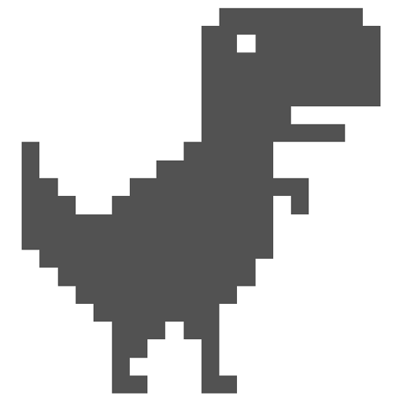

# Dinosaur Game P5.js

<a name="readme-top"></a>


[![Contributors][contributors-shield]][contributors-url]
[![Forks][forks-shield]][forks-url]
[![Stargazers][stars-shield]][stars-url]
[![MIT License][license-shield]][license-url]


<br />
<div align="center">
  <a href="https://github.com/diegoal3mx/Dinosaur-Game-P5js">
    
  </a>

<h3 align="center">Dinosaur Game - P5.js</h3>

  <p align="center">
    Chrome's Trex Runner Game built with P5.js library
    <br />
  </p>
</div>

<details>
  <summary>Table of Contents</summary>
  <ol>
    <li>
      <a href="#about-the-project">About The Project</a>
      <ul>
        <li><a href="#built-with">Built With</a></li>
      </ul>
    </li>
    <li>
      <a href="#playing-the-game">Playing the game</a>
      <ul>
        <li><a href="#how-to-play-online">How to play online</a></li>
        <li><a href="#how-to-play-locally">How to play locally</a></li>
        <li><a href="#controls">Controls</a></li>
      </ul>
    </li>
     <li><a href="#disclaimer">Disclaimer</a></li>
    <li><a href="#license">License</a></li>
    <li><a href="#contact">Contact</a></li>
  </ol>
</details>


## About The Project


P5.js version of Google Chrome's offline t-rex runner game, with infinite gameplay & cactuses and birds to avoid! You can find the Processing version of this game [here](https://github.com/diegoal3mx/Dinosaur-Game).

### Built With

* [![p5js][p5js]][p5js-url]

<p align="right">(<a href="#readme-top">back to top</a>)</p>

## Playing the game
### How to play online

* The game can be played [here](https://diegoal3mx.github.io/Dinosaur-Game-P5js/)

### How to play locally 

1. Clone the repo
   ```sh
   git clone https://github.com/diegoal3mx/Dinosaur-Game-P5js.git
   ```
2. Run index.html

<p align="right">(<a href="#readme-top">back to top</a>)</p>

## Controls

* **Start: `SPACE`** <br/>
* **Jump: `ARROW UP` , `SPACE`** <br/>
* **Crouch: `ARROW DOWN`** <br/>
* **Debug: `D`** <br/>

<p align="right">(<a href="#readme-top">back to top</a>)</p>

## Disclaimer

* The products, company names, images and logos mentioned on this game are trademarks of their respective owners.
* Tested on Windows 10

<p align="right">(<a href="#readme-top">back to top</a>)</p>

## License

Distributed under the MIT License. See [`LICENSE.txt`](https://github.com/diegoal3mx/Dinosaur-Game-P5js/blob/main/LICENSE.txt) for more information.

<p align="right">(<a href="#readme-top">back to top</a>)</p>


## Contact

Project Link: [https://github.com/diegoal3mx/Dinosaur-Game-P5js](https://github.com/diegoal3mx/Dinosaur-Game-P5js)

<p align="right">(<a href="#readme-top">back to top</a>)</p>


[contributors-shield]: https://img.shields.io/github/contributors/diegoal3mx/Dinosaur-Game-P5js.svg?style=for-the-badge
[contributors-url]: https://github.com/diegoal3mx/Dinosaur-Game-P5js/graphs/contributors
[forks-shield]: https://img.shields.io/github/forks/diegoal3mx/Dinosaur-Game-P5js.svg?style=for-the-badge
[forks-url]: https://github.com/diegoal3mx/Dinosaur-Game-P5js/network/members
[stars-shield]: https://img.shields.io/github/stars/diegoal3mx/Dinosaur-Game-P5js.svg?style=for-the-badge
[stars-url]: https://github.com/diegoal3mx/Dinosaur-Game-P5js/stargazers
[license-shield]: https://img.shields.io/github/license/diegoal3mx/Dinosaur-Game-P5js.svg?style=for-the-badge
[license-url]: https://github.com/diegoal3mx/Dinosaur-Game-P5js/blob/main/LICENSE.txt
[linkedin-shield]: https://img.shields.io/badge/-LinkedIn-black.svg?style=for-the-badge&logo=linkedin&colorB=555
[linkedin-url]: https://linkedin.com/in/linkedin_username
[p5js]:https://img.shields.io/badge/p5.js-ED225D?style=for-the-badge&logo=p5.js&logoColor=FFFFFF
[p5js-url]:https://p5js.org/
